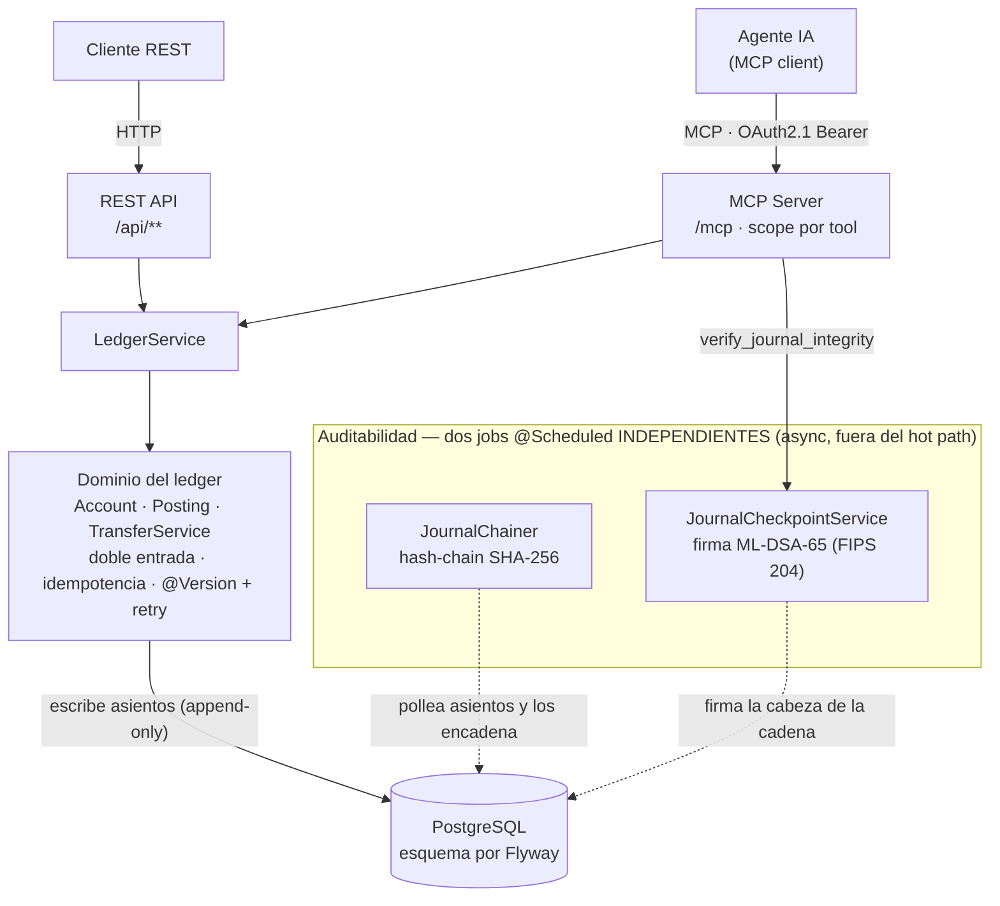

# LedgerMind

[](https://github.com/juanfranpaezz/ledgermind/actions/workflows/ci.yml)


> **Core de pagos** en Java/Spring Boot: **ledger de doble entrada append-only**, **idempotencia** por clave única (exactly-once) y **control de concurrencia** con optimistic locking + retry (probado con un spike de 50 transferencias concurrentes contra Postgres real), expuesto a un agente de IA por un **servidor MCP** con OAuth2.1, sobre una **escalera de auditabilidad** que termina en una **firma post-cuántica (ML-DSA / FIPS 204)** del journal.
>
> *<sub>EN — A payments core: append-only double-entry ledger, exactly-once idempotency and explicit concurrency control (optimistic locking + retry, proven by a 50-transfer concurrency spike on real Postgres), exposed to an AI agent through an OAuth2.1-secured MCP server, on an auditability ladder that ends in a post-quantum (ML-DSA / FIPS 204) signature of the journal.</sub>*

---

## Qué es

LedgerMind es el motor de cuentas y movimientos de una fintech: registra dinero como **asientos de doble entrada append-only**, impide por construcción (restricción `UNIQUE` en la DB) que un reintento duplique un cobro (**idempotencia**), y que el dinero no se cree ni se pierda bajo concurrencia (**optimistic locking + retry**). Es backend puro.

Encima del ledger hay dos cosas que lo separan de un CRUD:

1. **Un servidor MCP** (Model Context Protocol) que deja a un agente de IA **consultar y auditar** el ledger — nunca mover dinero —, protegido con **OAuth2.1** y *scopes* mínimos por herramienta.
2. **Una escalera de auditabilidad** que hace el journal *tamper-evident*: hash-chain → checkpoint firmado con criptografía **post-cuántica** → una herramienta MCP con la que el propio agente verifica la integridad.

> Está construido para ser **defendible**: cada decisión tiene su porqué y sus límites están escritos, no escondidos (ver [Alcance y límites honestos](#alcance-y-límites-honestos)).

---

## Demo

El camino confiable es **correr en local** (1 comando, ver [Cómo correr](#cómo-correr)). También suele haber una **instancia de demo efímera** en `https://childhood-stereo-cookie-praise.trycloudflare.com` (puede estar caída).

```bash
BASE=http://localhost:8080   # o la instancia de demo

# Crear dos cuentas y transferir (la transferencia es idempotente por idempotencyKey)
curl -s -XPOST $BASE/api/accounts -H 'Content-Type: application/json' \
  -d '{"address":"wallet:ana","asset":"ARS","allowNegative":true}'
curl -s -XPOST $BASE/api/accounts -H 'Content-Type: application/json' \
  -d '{"address":"wallet:beto","asset":"ARS"}'
curl -s -XPOST $BASE/api/transfers -H 'Content-Type: application/json' \
  -d '{"debitAddress":"wallet:ana","creditAddress":"wallet:beto","amount":50000,"idempotencyKey":"demo-1"}'

# Auditar la integridad del journal (mismo dato que ve el agente por MCP)
curl -s $BASE/api/journal/audit

# Flujo OAuth2.1 → MCP (perfil demo): pedir un token y llamar a /mcp con el Bearer
TOKEN=$(curl -s -u mcp-client:secret -d grant_type=client_credentials -d scope=ledger.read \
  $BASE/oauth2/token | sed -n 's/.*"access_token":"\([^"]*\)".*/\1/p')
curl -s -o /dev/null -w '%{http_code}\n' $BASE/mcp                              # sin token → 401
curl -s $BASE/mcp -H "Authorization: Bearer $TOKEN"                             # con token → MCP responde
```

---

## Arquitectura



Es un **monolito modular** (Spring Modulith): hoy un único *bounded context* `ledger` con adaptadores REST (`ledger.web`) y MCP (`ledger.mcp`), pensado para dividirse a medida que crezca. El esquema lo manda **Flyway**; Hibernate solo **valida**.

### La escalera de auditabilidad

| Capa | Qué hace | Qué garantiza (honesto) |
|------|----------|--------------------------|
| **1 · Hash-chain** | Encadena cada asiento: `entry_hash = SHA-256(prev_hash ‖ canonical(posting))` en una tabla *append-only* aparte (patrón AWS QLDB). | *Tamper-evidence*: editar un asiento ya encadenado rompe la cadena y se detecta el punto exacto. |
| **2 · Checkpoint firmado** | Firma la **cabeza de la cadena** con **ML-DSA-65** (post-cuántico, BouncyCastle) en checkpoints append-only (patrón *Signed Tree Head*). | Ancla la cabeza en el tiempo bajo un compromiso resistente a un futuro falsificador cuántico (*forge-later*). |
| **3 · Auditor MCP** | El tool `verify_journal_integrity` deja que **un agente** recomponga la cadena + valide la firma y reciba un veredicto. | Cierra el lazo: el sistema se audita a sí mismo y le explica el resultado a una IA. |

> La firma demuestra **crypto-agility** (interfaz `JournalSigner` intercambiable) y *tamper-evidence* firmado — **no** es prevención ni reemplaza el control de acceso. Los límites están en [Alcance y límites honestos](#alcance-y-límites-honestos).

---

## Cómo correr

Requisitos: **JDK 21** y **Docker** (para Postgres y para los tests con Testcontainers).

```bash
# 1) Postgres local
docker compose up -d

# 2) La app (perfil demo = incluye un Authorization Server embebido para emitir tokens del MCP)
./mvnw spring-boot:run -Dspring-boot.run.profiles=demo

# Tests (15, incluido el spike de concurrencia y el runtime real de ML-DSA). Solo necesita Docker:
./mvnw verify
```

---

## API y herramientas MCP

**REST** (`/api`)

| Método | Ruta | Qué hace |
|--------|------|----------|
| `POST` | `/api/accounts` | Crea una cuenta. |
| `GET`  | `/api/accounts/{address}` | Saldo y contadores de una cuenta. |
| `POST` | `/api/transfers` | Transferencia idempotente (doble entrada). |
| `GET`  | `/api/journal/verify` | Recomputa la hash-chain (Capa 1). |
| `GET`  | `/api/journal/checkpoint` | Último checkpoint firmado + clave pública + firma (Capa 2). |
| `GET`  | `/api/journal/checkpoint/verify` | Verifica firma + cadena en planos separados. |
| `GET`  | `/api/journal/audit` | Auditoría consolidada con veredicto legible (= tool MCP). |

**MCP** (`/mcp`, OAuth2.1 — *scope* `ledger.read` por tool, **solo lectura**)

| Tool | Qué hace |
|------|----------|
| `get_balance` | Saldo de una cuenta. |
| `list_transactions` | Movimientos de una cuenta. |
| `verify_journal_integrity` | Audita la integridad del journal (hash-chain + firma post-cuántica). |

El endpoint `/mcp` exige un **JWT Bearer** válido; sin token → `401`. En el perfil `demo`, un **Spring Authorization Server** embebido emite tokens (`client_credentials`) en `/oauth2/token`.

---

## Decisiones de diseño (con su porqué)

- **Dinero como enteros** (centavos / `BIGINT`), nunca `double` — el ledger tiene que cuadrar al centavo.
- **Saldo derivado** de contadores acumulados (`posted_debits/credits`) — lectura O(1), journal *append-only*.
- **Optimistic locking** (`@Version`) **+ retry** fuera de la transacción — previene *lost updates* sin serializar todo.
- **Idempotencia** por `idempotency_key` único — un reintento de red nunca duplica un movimiento.
- **Flyway dueño del esquema**, Hibernate solo valida — sin cambios destructivos silenciosos del ORM.
- **Testcontainers** (Postgres real, no H2) — los tests prueban el *locking* real de Postgres.
- **Todo en UTC** (JVM + Hibernate + DB) — timestamps de dinero sin ambigüedad.

Las decisiones formales más relevantes están como ADRs en [`docs/adr/`](docs/adr).

---

## Tests

15 tests (`./mvnw verify`), entre ellos:

- **Spike de concurrencia** — 50 transferencias en paralelo sobre una cuenta con saldo limitado: se verifica conservación del dinero, no-sobregiro y doble-entrada global.
- **Runtime de ML-DSA** — prueba que BouncyCastle *realmente firma y verifica* (no solo que compila), y rechaza datos alterados y claves ajenas.
- **Enforcement del scope MCP** — invoca la tool con y sin `SCOPE_ledger.read` y exige `AccessDeniedException` cuando falta.
- **Tamper-evidence** — edita un asiento por SQL directo y verifica que la cadena lo detecta y la firma queda disociada.

---

## Alcance y límites honestos

Esto es un **proyecto de demostración**; los límites están escritos a propósito (son parte del criterio de ingeniería):

- **Dinero simulado** — es una demostración de capacidad, no un sistema con compliance certificado.
- **Clave de firma efímera** — se genera al arranque. En producción la privada vive en **HSM/KMS** y la pública se **ancla fuera de la DB**; la verificación de firma prueba *integridad-de-mensaje*, no *autenticidad* del firmante sin ese ancla.
- **Tamper-EVIDENCE, no prevención** — un actor con escritura total en la DB puede reescribir contenido + cadena + checkpoint de forma consistente; lo que sube el costo y lo hace detectable es anclar externamente (HSM + log de transparencia + WORM). La auditoría **no** detecta por sí sola el *truncado* de la cola sin un *high-water-mark* externo.
- **`/api` abierto en la demo** — solo `/mcp` está bajo OAuth; en producción el read-model también iría con auth.
- **`verify()` es O(n)** — a escala real, el paso siguiente es Merkle + verificación incremental desde el último checkpoint.

---

## Stack

**Java 21** · **Spring Boot 3.5** · **Spring Modulith** · **Spring AI 1.1 (MCP server)** · **Spring Security / OAuth2.1** · **PostgreSQL 16 + Flyway** · **BouncyCastle (ML-DSA / FIPS 204)** · **Testcontainers** · **Actuator + Micrometer/Prometheus** · Docker · GitHub Actions.

---

<details>
<summary><b>English summary</b></summary>

LedgerMind is a payments backend in Java/Spring Boot: an **append-only double-entry ledger** with exact integer money, **exactly-once idempotency**, and explicit **concurrency control** (optimistic locking + retry), proven by a Testcontainers concurrency test. It exposes **read-only MCP tools** (Spring AI) to an AI agent behind an **OAuth2.1** resource server with per-tool scopes. On top sits a **three-layer auditability ladder**: a SHA-256 **hash-chain** (tamper-evidence), a **post-quantum ML-DSA / FIPS 204 signature** of the chain head (Signed Tree Head), and an MCP tool (`verify_journal_integrity`) that lets the agent audit the journal itself. Limitations (ephemeral demo key, tamper-evidence vs prevention, O(n) verification) are documented on purpose. See [`docs/adr/`](docs/adr) for the rationale behind each decision.

</details>
