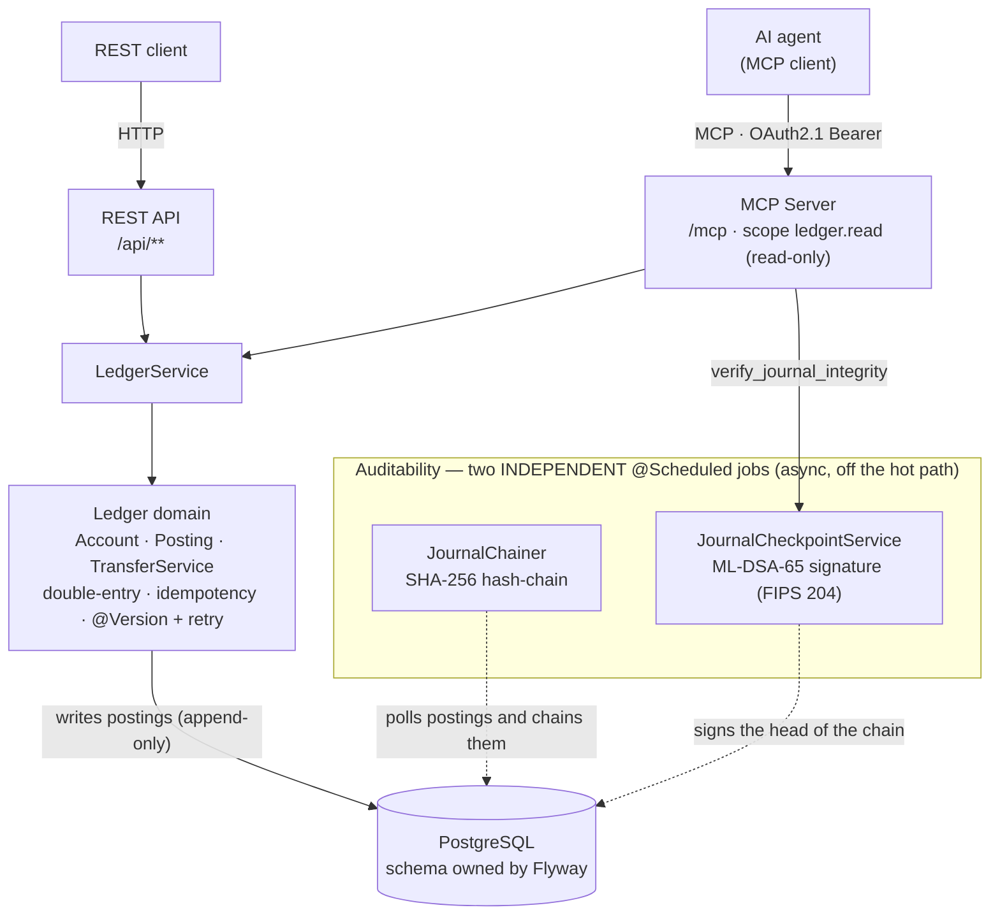

# LedgerMind — Java 21 / Spring Boot payments core

**Append-only double-entry ledger, idempotent transfers, safe concurrency (Testcontainers-proven), exposed to an AI agent through an OAuth 2.1 MCP server.**

Built by Juan Francisco Paez — Top 8, Anthropic × Kaszek Hackathon (Buenos Aires, April 2026).

[](https://github.com/juanfranpaezz/ledgermind/actions/workflows/ci.yml)


> **A payments core** in Java/Spring Boot: an **append-only double-entry ledger**, **idempotency** by unique key (exactly-once) and **concurrency control** with optimistic locking + retry (proven with a spike of 50 concurrent transfers against real Postgres), exposed to an AI agent through an **MCP server** with OAuth 2.1, on top of an **auditability ladder** that ends in a **post-quantum signature (ML-DSA / FIPS 204)** of the journal.

---

## What it is

LedgerMind is the accounts-and-movements engine of a fintech: it records money as **append-only double-entry postings**, makes it structurally impossible (a `UNIQUE` constraint in the DB) for a retry to duplicate a charge (**idempotency**), and prevents money from being created or lost under concurrency (**optimistic locking + retry**). It is pure backend.

On top of the ledger there are two things that set it apart from a CRUD app:

1. **An MCP server** (Model Context Protocol) that lets an AI agent **query and audit** the ledger — never move money — protected with **OAuth 2.1**: every tool enforces its scope with `@PreAuthorize`, and since all four are **read-only** they share the single `ledger.read` scope (see the granularity note in [Scope and honest limits](#scope-and-honest-limits)).
2. **An auditability ladder** that makes the journal *tamper-evident*: hash-chain → checkpoint signed with **post-quantum** cryptography → an MCP tool with which the agent itself verifies integrity.

> It is built to be **defensible**: every decision has its rationale and its limits are written down, not hidden (see [Scope and honest limits](#scope-and-honest-limits)).

---

## Demo

The reliable path is to **run it locally** (1 command, see [How to run](#how-to-run)).

```bash
BASE=http://localhost:8080   # or your own deployed instance

# Create two accounts and transfer (the transfer is idempotent by idempotencyKey)
curl -s -XPOST $BASE/api/accounts -H 'Content-Type: application/json' \
  -d '{"address":"wallet:ana","asset":"ARS","allowNegative":true}'
curl -s -XPOST $BASE/api/accounts -H 'Content-Type: application/json' \
  -d '{"address":"wallet:beto","asset":"ARS"}'
curl -s -XPOST $BASE/api/transfers -H 'Content-Type: application/json' \
  -d '{"debitAddress":"wallet:ana","creditAddress":"wallet:beto","amount":50000,"idempotencyKey":"demo-1"}'

# Audit the integrity of the journal (the same data the agent sees over MCP)
curl -s $BASE/api/journal/audit

# OAuth2.1 → MCP flow (demo profile): request a token and call /mcp with the Bearer
TOKEN=$(curl -s -u mcp-client:secret -d grant_type=client_credentials -d scope=ledger.read \
  $BASE/oauth2/token | sed -n 's/.*"access_token":"\([^"]*\)".*/\1/p')
curl -s -o /dev/null -w '%{http_code}\n' $BASE/mcp                              # no token → 401
curl -s $BASE/mcp -H "Authorization: Bearer $TOKEN"                             # with token → MCP responds
```

---

## Architecture


```mermaid
flowchart TB
    U["REST client"]
    AG["AI agent<br/>(MCP client)"]

    U -->|HTTP| API["REST API<br/>/api/**"]
    AG -->|"MCP · OAuth2.1 Bearer"| MCP["MCP Server<br/>/mcp · scope ledger.read (read-only)"]

    API --> SVC["LedgerService"]
    MCP --> SVC

    SVC --> DOM["Ledger domain<br/>Account · Posting · TransferService<br/>double-entry · idempotency · @Version + retry"]
    DOM -->|"writes postings (append-only)"| PG[("PostgreSQL<br/>schema owned by Flyway")]

    subgraph AUD["Auditability — two INDEPENDENT @Scheduled jobs (async, off the hot path)"]
      CH["JournalChainer<br/>SHA-256 hash-chain"]
      CHK["JournalCheckpointService<br/>ML-DSA-65 signature (FIPS 204)"]
    end
    CH -.->|"polls postings and chains them"| PG
    CHK -.->|"signs the head of the chain"| PG
    MCP -->|"verify_journal_integrity"| CHK
```

It is a **modular monolith** (Spring Modulith): today a single `ledger` bounded context with REST (`ledger.web`) and MCP (`ledger.mcp`) adapters, designed to be split as it grows. The schema is owned by **Flyway**; Hibernate only **validates**.

### The auditability ladder

| Layer | What it does | What it guarantees (honestly) |
|------|----------|--------------------------|
| **1 · Hash-chain** | Chains every posting: `entry_hash = SHA-256(prev_hash ‖ canonical(posting))` in a separate *append-only* table (AWS QLDB pattern). | *Tamper-evidence*: editing an already-chained posting breaks the chain and the exact point is detected. |
| **2 · Signed checkpoint** | Signs the **head of the chain** with **ML-DSA-65** (post-quantum, BouncyCastle) in append-only checkpoints (*Signed Tree Head* pattern). | Anchors the head in time under a commitment resistant to a future quantum forger (*forge-later*). |
| **3 · MCP auditor** | The `verify_journal_integrity` tool lets **an agent** recompute the chain, validate the signature and receive a verdict. | Closes the loop: the system audits itself and explains the result to an AI. |

> The signature demonstrates **crypto-agility** (a swappable `JournalSigner` interface) and signed *tamper-evidence* — it is **not** prevention and it does not replace access control. The limits are in [Scope and honest limits](#scope-and-honest-limits).

---

## How to run

Requirements: **JDK 21** and **Docker** (for Postgres and for the Testcontainers tests).

```bash
# 1) Local Postgres
docker compose up -d

# 2) The app (demo profile = includes an embedded Authorization Server to issue MCP tokens)
./mvnw spring-boot:run -Dspring-boot.run.profiles=demo

# Tests (concurrency spike, real ML-DSA runtime, scope enforcement, reconciliation...). Only needs Docker:
./mvnw verify
```

---

## API and MCP tools

**REST** (`/api`)

| Method | Path | What it does |
|--------|------|----------|
| `POST` | `/api/accounts` | Creates an account. |
| `GET`  | `/api/accounts/{address}` | Balance and counters of an account. |
| `POST` | `/api/transfers` | Idempotent transfer (double-entry). |
| `GET`  | `/api/journal/verify` | Recomputes the hash-chain (Layer 1). |
| `GET`  | `/api/journal/checkpoint` | Latest signed checkpoint + public key + signature (Layer 2). |
| `GET`  | `/api/journal/checkpoint/verify` | Verifies signature and chain on separate planes. |
| `GET`  | `/api/journal/audit` | Consolidated audit with a human-readable verdict (= the MCP tool). |
| `POST` | `/api/reconciliation` | Reconciles a PSP settlement feed against the ledger (deterministic matching by reference). |

**MCP** (`/mcp`, OAuth 2.1 — all 4 tools enforce the `ledger.read` *scope* (single, read-only) + **audience** validation)

| Tool | What it does |
|------|----------|
| `get_balance` | Balance of an account. |
| `list_transactions` | Movements of an account. |
| `verify_journal_integrity` | Audits the integrity of the journal (hash-chain + post-quantum signature). |
| `explain_reconciliation_discrepancy` | Reconciles the ledger against the PSP feed and returns the classified discrepancies (the AI narrates them; the code decides). |

The `/mcp` endpoint requires a valid **JWT Bearer**; without a token → `401`. Under the `demo` profile, an embedded **Spring Authorization Server** issues tokens (`client_credentials`) at `/oauth2/token`.

---

## Design decisions (with their rationale)

- **Money as integers** (cents / `BIGINT`), never `double` — the ledger has to balance to the cent.
- **Balance derived** from accumulated counters (`posted_debits/credits`) — O(1) reads, *append-only* journal.
- **Optimistic locking** (`@Version`) **+ retry** outside the transaction — prevents *lost updates* without serializing everything.
- **Idempotency** by unique `idempotency_key` — a network retry never duplicates a movement.
- **Flyway owns the schema**, Hibernate only validates — no silent destructive changes from the ORM.
- **Testcontainers** (real Postgres, not H2) — the tests exercise Postgres's real *locking*.
- **Everything in UTC** (JVM + Hibernate + DB) — money timestamps with no ambiguity.

The most relevant formal decisions are recorded as ADRs in [`docs/adr/`](docs/adr).

---

## Tests

The suite (`./mvnw verify`, against real Postgres) includes, among others:

- **Concurrency spike** — 50 parallel transfers over an account with a limited balance: money conservation, no overdraft and global double-entry are all verified.
- **Exactly-once idempotency** — 24 requests with the same key in parallel receive the same posting (a replay, not a 500); reusing the key with different parameters → 409.
- **ML-DSA runtime** — proves that BouncyCastle *actually signs and verifies* (not just that it compiles), and rejects tampered data and foreign keys.
- **MCP security** — every tool enforces the `ledger.read` scope (with `SCOPE_other` → `AccessDeniedException`, proven by invoking it, not just by the annotation being present) + the SAS issues `aud=ledgermind-mcp` (audience validation).
- **Tamper-evidence** — edits a posting via direct SQL and verifies that the chain detects it and the signature comes apart.
- **Reconciliation** — a deterministic matcher that balances and classifies the 4 discrepancies (including duplicate PSP references, which are aggregated rather than falsely matched).

---

## Scope and honest limits

This is a **demonstration project**; the limits are written down on purpose (they are part of the engineering judgement):

- **Simulated money** — it is a demonstration of capability, not a system with certified compliance.
- **Ephemeral signing key** — generated at startup. In production the private key lives in an **HSM/KMS** and the public key is **anchored outside the DB**; signature verification proves *message integrity*, not signer *authenticity*, without that anchor.
- **Tamper-EVIDENCE, not prevention** — an actor with full write access to the DB can consistently rewrite content + chain + checkpoint; what raises the cost and makes it detectable is anchoring externally (HSM + transparency log + WORM). The audit **cannot** by itself detect *truncation* of the tail without an external high-water-mark.
- **A single scope for the four MCP tools** — the granularity is one of *enforcement* (each tool checks its own `@PreAuthorize`), not of *privilege*: all four ask for the same `ledger.read`, because **they are all read-only** and a single scope is enough. The day a state-changing tool is added (or a second, less-trusted client that must audit but not reconcile), the documented next step is to split into `ledger.audit` / `ledger.reconcile` for real least-privilege per capability. Today that would be ceremony.
- **`/api` is open in the demo** — only `/mcp` is behind OAuth (with audience validation); in production the read model would also be authenticated. The `/api/demo/*` endpoints (reset/tamper) exist only under the `demo` profile and are rate-limited.
- **`verify()` is O(n)** — at real scale, the next step is Merkle + incremental verification from the last checkpoint.
- **Reconciliation against a simulated feed** — matching is by exact reference + amount (no tolerance, no T+N window, no multi-currency); in production the feed would come from the PSP's real file and be reconciled by window. It assumes `idempotencyKey == the client's order id` as the correlation axis.

---

## Stack

**Java 21** · **Spring Boot 3.5** · **Spring Modulith** · **Spring AI 1.1 (MCP server)** · **Spring Security / OAuth 2.1** · **PostgreSQL 16 + Flyway** · **BouncyCastle (ML-DSA / FIPS 204)** · **Testcontainers** · **Actuator + Micrometer/Prometheus** · Docker · GitHub Actions.

---

<details>
<summary><b>Resumen en español</b></summary>

LedgerMind es un backend de pagos en Java/Spring Boot: un **ledger de doble entrada append-only** con dinero como entero exacto, **idempotencia exactly-once** y **control de concurrencia** explícito (optimistic locking + retry), probado con un test de concurrencia sobre Testcontainers. Expone **herramientas MCP de solo lectura** (Spring AI) a un agente de IA detrás de un resource server **OAuth 2.1**: cada herramienta enforza el scope con `@PreAuthorize` y, como las cuatro son de solo lectura, comparten el único scope `ledger.read` (*enforcement* por herramienta, un solo *privilegio*), más **validación de audiencia** (defensa contra el *confused deputy*). Encima hay una **escalera de auditabilidad de tres capas**: una **hash-chain** SHA-256 (tamper-evidence), una **firma post-cuántica ML-DSA / FIPS 204** de la cabeza de la cadena (Signed Tree Head) y una herramienta MCP (`verify_journal_integrity`) con la que el agente audita el journal por su cuenta. Un módulo de **reconciliación** cuadra de forma determinista un feed de liquidación del PSP contra el ledger y clasifica los descuadres (la IA solo los narra; el código decide). Las limitaciones (clave de demo efímera, tamper-evidence vs prevención, verificación O(n), feed simulado) están documentadas a propósito. El porqué de cada decisión está en [`docs/adr/`](docs/adr).

</details>
