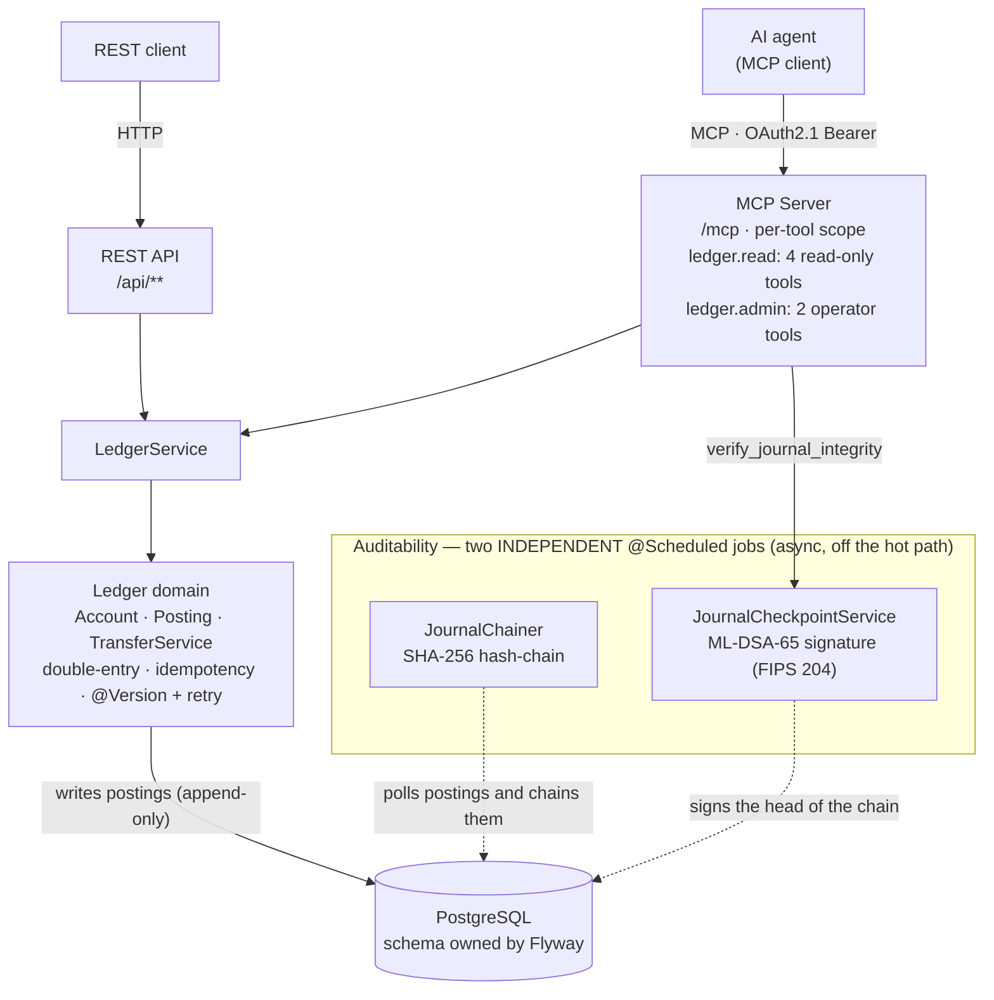

# LedgerMind — Java 21 / Spring Boot payments core

**Append-only double-entry ledger, idempotent transfers, safe concurrency (Testcontainers-proven), exposed to an AI agent through an OAuth 2.1 MCP server.**

Built by Juan Francisco Paez — Top 8, Anthropic × Kaszek Hackathon (Buenos Aires, April 2026).

[](https://github.com/juanfranpaezz/ledgermind/actions/workflows/ci.yml)


> **A payments core** in Java/Spring Boot: an **append-only double-entry ledger**, **idempotency** by unique key (exactly-once) and **concurrency control** with optimistic locking + retry (proven with a spike of 50 concurrent transfers against real Postgres), exposed to an AI agent through an **MCP server** with OAuth 2.1, on top of an **auditability ladder** that ends in a **post-quantum signature (ML-DSA / FIPS 204)** of the journal.

---

## What it is

LedgerMind is the accounts-and-movements engine of a fintech: it records money as **append-only double-entry postings**, makes it structurally impossible (a `UNIQUE` constraint in the DB) for a retry to duplicate a charge (**idempotency**), and prevents money from being created or lost under concurrency (**optimistic locking + retry**). It is pure backend.

On top of the ledger there are two things that set it apart from a CRUD app:

1. **An MCP server** (Model Context Protocol) that lets an AI agent **query and audit** the ledger — never move money — protected with **OAuth 2.1**: every tool enforces its scope with `@PreAuthorize`. The four query and audit tools are **read-only** and share the single `ledger.read` scope; two **operator** tools (`list_frozen_accounts`, `unfreeze_account`) require `ledger.admin` and do not move money either (see the granularity note in [Scope and honest limits](#scope-and-honest-limits)).
2. **An auditability ladder** that makes the journal *tamper-evident* **against the edit or deletion of postings already covered by a signed checkpoint** (not against an insert, edit or delete, with the balance counters adjusted, on postings not yet chained or in the tail after the last checkpoint; and a burst of legitimate traffic leaves coverage degraded (`coverageDegraded`), not a tamper alarm — see [Scope and honest limits](#scope-and-honest-limits)): hash-chain → checkpoint signed with **post-quantum** cryptography → an MCP tool with which the agent itself verifies integrity.

> It is built to be **defensible**: every decision has its rationale and its limits are written down, not hidden (see [Scope and honest limits](#scope-and-honest-limits)).

---

## Demo

The reliable path is to **run it locally** (1 command, see [How to run](#how-to-run)).

```bash
BASE=http://localhost:8080   # or your own deployed instance

# Create two accounts and transfer (the transfer is idempotent by idempotencyKey)
curl -s -XPOST $BASE/api/accounts -H 'Content-Type: application/json' \
  -d '{"address":"wallet:ana","asset":"ARS","allowNegative":true}'
curl -s -XPOST $BASE/api/accounts -H 'Content-Type: application/json' \
  -d '{"address":"wallet:beto","asset":"ARS"}'
curl -s -XPOST $BASE/api/transfers -H 'Content-Type: application/json' \
  -d '{"debitAddress":"wallet:ana","creditAddress":"wallet:beto","amount":50000,"idempotencyKey":"demo-1"}'

# Audit the integrity of the journal (the same data the agent sees over MCP)
curl -s $BASE/api/journal/audit

# OAuth2.1 → MCP flow (demo profile): request a token and call /mcp with the Bearer
TOKEN=$(curl -s -u mcp-client:secret -d grant_type=client_credentials -d scope=ledger.read \
  $BASE/oauth2/token | sed -n 's/.*"access_token":"\([^"]*\)".*/\1/p')
curl -s -o /dev/null -w '%{http_code}\n' $BASE/mcp                              # no token → 401
curl -s $BASE/mcp -H "Authorization: Bearer $TOKEN"                             # with token → MCP responds
```

> **In the demo the token carries only the `ledger.read` scope.** The operator tools `list_frozen_accounts` and `unfreeze_account` require `ledger.admin`, which the demo Authorization Server does not issue: they cannot be used in the demo.

---

## Architecture


```mermaid
flowchart TB
    U["REST client"]
    AG["AI agent<br/>(MCP client)"]

    U -->|HTTP| API["REST API<br/>/api/**"]
    AG -->|"MCP · OAuth2.1 Bearer"| MCP["MCP Server<br/>/mcp · per-tool scope<br/>ledger.read: 4 read-only tools<br/>ledger.admin: 2 operator tools"]

    API --> SVC["LedgerService"]
    MCP --> SVC

    SVC --> DOM["Ledger domain<br/>Account · Posting · TransferService<br/>double-entry · idempotency · @Version + retry"]
    DOM -->|"writes postings (append-only)"| PG[("PostgreSQL<br/>schema owned by Flyway")]

    subgraph AUD["Auditability — two INDEPENDENT @Scheduled jobs (async, off the hot path)"]
      CH["JournalChainer<br/>SHA-256 hash-chain"]
      CHK["JournalCheckpointService<br/>ML-DSA-65 signature (FIPS 204)"]
    end
    CH -.->|"polls postings and chains them"| PG
    CHK -.->|"signs the head of the chain"| PG
    MCP -->|"verify_journal_integrity"| CHK
```

It is a **modular monolith** (Spring Modulith): today a single `ledger` bounded context with REST (`ledger.web`) and MCP (`ledger.mcp`) adapters, designed to be split as it grows. The schema is owned by **Flyway**; Hibernate only **validates**.

### The auditability ladder

| Layer | What it does | What it guarantees (honestly) |
|------|----------|--------------------------|
| **1 · Hash-chain** | Chains every posting: `entry_hash = SHA-256(prev_hash ‖ canonical(posting))` in a separate *append-only* table (AWS QLDB pattern). | *Tamper-evidence*: editing an already-chained posting breaks the chain and the exact point is detected. |
| **2 · Signed checkpoint** | Signs the **head of the chain** with **ML-DSA-65** (post-quantum, BouncyCastle) in append-only checkpoints (*Signed Tree Head* pattern). | Anchors the head in time under a commitment resistant to a future quantum forger (*forge-later*). |
| **3 · MCP auditor** | The `verify_journal_integrity` tool lets **an agent** recompute the chain, validate the signature and receive a verdict. | Closes the loop: the system audits itself and explains the result to an AI. |

> The signature demonstrates **crypto-agility** (a swappable `JournalSigner` interface) and signed *tamper-evidence* — it is **not** prevention and it does not replace access control. The limits are in [Scope and honest limits](#scope-and-honest-limits).

---

## How to run

Requirements: **JDK 21** and **Docker** (for Postgres and for the Testcontainers tests).

```bash
# 1) Local Postgres
docker compose up -d

# 2) The app (demo profile = includes an embedded Authorization Server to issue MCP tokens)
./mvnw spring-boot:run -Dspring-boot.run.profiles=demo

# Tests (concurrency spike, real ML-DSA runtime, scope enforcement, reconciliation...). Only needs Docker:
./mvnw verify
```

> **Upgrading an existing database (operators).** Flyway applies `V5__overdraft_sweep.sql` on the next start. It only creates tables and an index (`overdraft_sweep_state`, `account_derived_total`, `overdraft_flag` with one active flag per account, `journal_chainer_state`) and seeds the single sweep-state row; it does not alter existing tables. The sweep-state row starts at watermark 0, so the **first sweep after the upgrade** re-derives every account that has postings from its full journal (one REPEATABLE READ transaction whose cost grows with the whole history) and **freezes any existing account whose derived balance already violates its overdraft rule**: its transfers then get `423 Locked` until an operator runs `unfreeze_account` (scope `ledger.admin`). If you ran a pre-release build whose V5 differed, Flyway refuses to start with a checksum mismatch: that only affects development volumes, so recreate the local Postgres volume (e.g. `docker compose down -v`, which deletes its data).

---

## API and MCP tools

**REST** (`/api`)

| Method | Path | What it does |
|--------|------|----------|
| `POST` | `/api/accounts` | Creates an account. |
| `GET`  | `/api/accounts/{address}` | Balance and counters of an account. |
| `POST` | `/api/transfers` | Idempotent transfer (double-entry). |
| `GET`  | `/api/journal/verify` | Recomputes the hash-chain (Layer 1). |
| `GET`  | `/api/journal/checkpoint` | Latest signed checkpoint + public key + signature (Layer 2). |
| `GET`  | `/api/journal/checkpoint/verify` | Verifies signature and chain on separate planes. |
| `GET`  | `/api/journal/audit` | Consolidated audit with a human-readable verdict (= the MCP tool). |
| `POST` | `/api/reconciliation` | Reconciles a PSP settlement feed against the ledger (deterministic matching by reference). |

**MCP** (`/mcp`, OAuth 2.1 — per-tool *scope* + **audience** validation: `ledger.read` for the 4 query and audit tools, `ledger.admin` for the 2 operator tools; none of them moves money)

> **In the demo the token carries only `ledger.read`**: `list_frozen_accounts` and `unfreeze_account` (scope `ledger.admin`) cannot be used there, because the demo Authorization Server does not issue that scope.

| Tool | What it does |
|------|----------|
| `get_balance` | Balance of an account. |
| `list_transactions` | Movements of an account. |
| `verify_journal_integrity` | Audits the integrity of the journal (hash-chain + post-quantum signature + balances + coverage). `tamperDetected` = confirmed evidence only; `coverageDegraded` + `coverageReason` (`ATRASADO` / `DETENIDO` / `SIN_CHECKPOINT`: chainer behind / chainer stopped / no checkpoint yet) = "cannot confirm right now". |
| `explain_reconciliation_discrepancy` | Reconciles the ledger against the PSP feed and returns the classified discrepancies (the AI narrates them; the code decides). |
| `list_frozen_accounts` | *(operator, `ledger.admin`)* Accounts frozen by the overdraft sweep, with the evidence. |
| `unfreeze_account` | *(operator, `ledger.admin`)* Unfreezes an account; records who (from the token) and why. |

The `/mcp` endpoint requires a valid **JWT Bearer**; without a token → `401`. Under the `demo` profile, an embedded **Spring Authorization Server** issues tokens (`client_credentials`) at `/oauth2/token`.

---

## Design decisions (with their rationale)

- **Money as integers** (cents / `BIGINT`), never `double` — the ledger has to balance to the cent.
- **Balance derived** from accumulated counters (`posted_debits/credits`) — O(1) reads, *append-only* journal.
- **Optimistic locking** (`@Version`) **+ retry** outside the transaction — prevents *lost updates* without serializing everything.
- **Idempotency** by unique `idempotency_key` — a network retry never duplicates a movement.
- **Flyway owns the schema**, Hibernate only validates — no silent destructive changes from the ORM.
- **Testcontainers** (real Postgres, not H2) — the tests exercise Postgres's real *locking*.
- **Everything in UTC** (JVM + Hibernate + DB) — money timestamps with no ambiguity.

The most relevant formal decisions are recorded as ADRs in [`docs/adr/`](docs/adr).

---

## Tests

The suite (`./mvnw verify`, against real Postgres) includes, among others:

- **Concurrency spike** — 50 parallel transfers over an account with a limited balance: money conservation, no overdraft and global double-entry are all verified.
- **Exactly-once idempotency** — 24 requests with the same key in parallel receive the same posting (a replay, not a 500); reusing the key with different parameters → 409.
- **ML-DSA runtime** — proves that BouncyCastle *actually signs and verifies* (not just that it compiles), and rejects tampered data and foreign keys.
- **MCP security** — scope enforcement proven by invoking the tool, not just by the annotation being present: the audit tool runs with `ledger.read` and is denied with `SCOPE_other` (`AccessDeniedException`); the operator tool `unfreeze_account` is denied with `ledger.read` and runs with `ledger.admin` + the SAS issues `aud=ledgermind-mcp` (audience validation).
- **Tamper-evidence** — edits a posting via direct SQL and verifies that the chain detects it and the signature comes apart.
- **Reconciliation** — a deterministic matcher that balances and classifies the 4 discrepancies (including duplicate PSP references, which are aggregated rather than falsely matched).

---

## Scope and honest limits

This is a **demonstration project**; the limits are written down on purpose (they are part of the engineering judgement):

- **Simulated money** — it is a demonstration of capability, not a system with certified compliance.
- **Ephemeral signing key** — generated at startup. In production the private key lives in an **HSM/KMS** and the public key is **anchored outside the DB**; signature verification proves *message integrity*, not signer *authenticity*, without that anchor.
- **Tamper-EVIDENCE, not prevention** — an actor with full write access to the DB can consistently rewrite content + chain + checkpoint; what raises the cost and makes it detectable is anchoring externally (HSM + transparency log + WORM). The audit **cannot** by itself detect *truncation* of the tail without an external high-water-mark.
- **What the audit covers, measured** — it detects the edit or deletion of a posting **covered by the last signed checkpoint**, even if the editor recomputes the links (that changes the signed head), unless the checkpoint is rewritten too. It does **not** detect, when the same DB writer also adjusts the balance counters: (a) the **insertion** of a posting — with a recent timestamp it is indistinguishable from a legitimate posting just written inside the chainer's normal window (`unchainedGraceMs`: 60 s by default, never less than 3 chainer cycles), and with any timestamp it gets chained as legitimate as soon as the chainer runs; (b) the edit, offset (+x/−x) or not, of a posting not yet chained; (c) the deletion of a posting not yet chained; (d) the edit or deletion of a posting **already chained but later than the last checkpoint**, recomputing the links (the link is an unkeyed SHA-256): the next checkpoint signs the forged version. The audit **counts** unchained postings (`unchainedPostings`) and those older than that window (`staleUnchainedPostings`), and it **does** flag one of those as tamper when it was written by a transaction that started **after** the last confirmed chainer pass and its timestamp is earlier than that pass minus the window; but this is **transient**: a posting inserted with an old timestamp was flagged, and 2.9 s later the production chainer had already chained it and it stopped being flagged. That flag also depends on evidence the same DB writer can forge: the last confirmed chainer pass is read from the `journal_chainer_state` row, so deleting that row, or raising its `pass_xid`, makes the next audit report the same inserted posting as `coverageDegraded=true` (`ATRASADO`/`DETENIDO`) with `tamperDetected=false` (pinned by `ChainerStateForgeryDowngradeTest`). Anchoring the head externally is not enough (the next anchor would cover the forged posting): closing this needs provenance created at the app's write that the DB cannot forge, e.g. a MAC with a key the DB does not hold, and for deletion also binding the order. It is a pending design decision.
- **Overdraft re-derived from the journal (watermarked sweep + freeze)** — the overdraft `CHECK` looks at the cached counters, which are never recomputed. A job (`ledgermind.overdraft.sweep-delay-ms`, 10 s by default) picks ONLY the accounts touched by new postings since the last watermark (persisted in the DB: it survives a restart), re-derives each one from **all** of its journal postings (not from an incremental total), and freezes the account whose derived balance violates its overdraft rule. **An overdraft is detected within ≤ the sweep interval + the duration of the sweep, and the account is then frozen** (the cost of a pass grows with the full history of the touched accounts, not only with the new postings). Frozen = transfers are rejected, as source or destination, with `423 Locked` and a dedicated ProblemDetail, until an operator unfreezes it with the MCP tool `unfreeze_account` (scope `ledger.admin`; who, from the token, and why are recorded). The transfer only adds one indexed read; it re-derives nothing. It does **not** prevent the first transfer after the tampering (it freezes afterwards). An edit to an already-swept posting (below the watermark) is seen on the first pass after the account receives a new posting; until then only the audit (counters) and the hash-chain, if the posting is chained, see it. It **does not detect** a posting inserted out-of-band with an id **below** the watermark (e.g. `id = -1` with `OVERRIDING SYSTEM VALUE`) on an account that never moves again: a documented decision, pinned by a test. If two sweeps run at the same time (several instances), the loser fails with a serialization error and rolls back, **without retry**: the next pass covers its share.
- **Under load: degraded coverage, not an alarm** — with the production configuration, 4,000 legitimate transfers in 30 s left the chainer behind (it drains ~200 postings every 5 s): `staleUnchainedPostings` reached 1,170 and cleared by itself after ~120 s. That comes out as `coverageDegraded=true` with `coverageReason=ATRASADO` (chainer behind) and `tamperDetected=false`: `tamperDetected` is reserved for confirmed evidence. An old unchained posting counts as an out-of-band insert **only** if it was written by a transaction that started after the last **confirmed** chainer pass (its `xmin` against the xid that pass takes when it starts and stores in the same transaction as its links) and its timestamp is earlier than that pass minus the window; a slow legitimate transaction that was still open when the chainer ran does not meet the first condition. The other false alarm (the balance replay read the journal and the counters in separate statements under READ COMMITTED) is closed: the audit runs in **one** REPEATABLE READ snapshot. Measured in `LiveBurstFloorGraceTest` (clean 8 s burst, window at its 900 ms floor) and `LiveBurstProductionDefaultsTest` (production values): zero out-of-band flags, zero `MANIPULACION DETECTADA` verdicts, zero `tamperDetected`. Limit: an out-of-band insert whose transaction was already open when the chainer ran, or whose timestamp is later than that pass minus the window, cannot be told apart from a legitimate one.
- **A signal that exists and the audit does not use** — every legitimate transfer bumps `account.version` and `account.updated_at` on both accounts; a naive 3-statement SQL mint (the posting INSERT plus the two counters) does not (measured: `version` ends 1 below the number of postings touching the account, against 0 under legitimate traffic, and `updated_at` ends older than the last posting). It is a cheap signal against an attacker who did not read the schema, and one who also bumps those two columns defeats it at no cost. The audit does **not** look at it today; wiring it in is the owner's decision.
- **Money conservation is implied, not checked separately** — the audit has no separate `sum(posted_debits) == sum(posted_credits)` check. It does not need one to catch a counter edit: every posting row carries one positive amount, one debit account and a different credit account (both foreign keys to `account`), so the journal is conserved by construction, and `balancesConsistent=true` means every account's counters equal its journal sums, which makes the counters conserved too. A counter edit that breaks conservation therefore also makes `balancesConsistent=false` (pinned by `PendingCountersAndConservationTest`).
- **No holds: `pending_debits` / `pending_credits` are always 0** — the schema, `Account.availableBalance()` and the overdraft sweep carry a pending (hold) term reserved for a future two-phase flow, but no code path writes it: both columns stay 0, the available balance is posted credits minus posted debits, and the balance replay does not look at them (pinned by `PendingCountersAndConservationTest`).
- **One scope for the four read tools, a separate one for the operator tools** — among the four read-only tools the granularity is one of *enforcement* (each tool checks its own `@PreAuthorize`), not of *privilege*: all four ask for the same `ledger.read`, because a single scope is enough for read-only access. The two operator tools (`list_frozen_accounts`; `unfreeze_account`, which changes an account's state but moves no money) require the separate `ledger.admin`. The documented next step for real least-privilege among the read tools (e.g. a second, less-trusted client that must audit but not reconcile) is still to split `ledger.read` into `ledger.audit` / `ledger.reconcile`. Today that would be ceremony.
- **`/api` is open, and the audit endpoint is expensive** — only `/mcp` is behind OAuth (with audience validation). `/api` needs no credentials in any profile, including `GET /api/journal/audit`, which the demo page calls. Every audit call reads the whole journal: the hash-chain recompute loads every chained posting through JPA (in batches of 200) and the balance replay aggregates every posting in one SQL statement, so its cost grows with the journal. The only brake is one **global** rate-limit counter, 30 requests per 10 s shared by every caller of `/api/demo/*` and `/api/journal/*`, matched on the decoded, normalized path the server routes (so a percent-encoded path such as `/api/%6Aournal/audit` is counted too, pinned by `RateLimitEncodedPathTest`): it caps the load, but one anonymous caller can use up the window and legitimate audits get `429` until it resets. In production the read model would be authenticated and rate-limited per client. The `/api/demo/*` endpoints (reset/tamper) exist only under the `demo` profile.
- **`verify()` is O(n)** — at real scale, the next step is Merkle + incremental verification from the last checkpoint.
- **Reconciliation against a simulated feed** — matching is by exact reference + amount (no tolerance, no T+N window, no multi-currency); in production the feed would come from the PSP's real file and be reconciled by window. It assumes `idempotencyKey == the client's order id` as the correlation axis.

---

## Stack

**Java 21** · **Spring Boot 3.5** · **Spring Modulith** · **Spring AI 1.1 (MCP server)** · **Spring Security / OAuth 2.1** · **PostgreSQL 16 + Flyway** · **BouncyCastle (ML-DSA / FIPS 204)** · **Testcontainers** · **Actuator + Micrometer/Prometheus** · Docker · GitHub Actions.

---

<details>
<summary><b>Resumen en español</b></summary>

LedgerMind es un backend de pagos en Java/Spring Boot: un **ledger de doble entrada append-only** con dinero como entero exacto, **idempotencia exactly-once** y **control de concurrencia** explícito (optimistic locking + retry), probado con un test de concurrencia sobre Testcontainers. Expone **herramientas MCP** (Spring AI) a un agente de IA detrás de un resource server **OAuth 2.1**: cada herramienta enforza su scope con `@PreAuthorize`; las cuatro de consulta y auditoría son de solo lectura y comparten el único scope `ledger.read` (*enforcement* por herramienta, un solo *privilegio*), y dos herramientas de operador (`list_frozen_accounts`, `unfreeze_account`) exigen `ledger.admin` y tampoco mueven dinero (no se pueden usar en la demo, cuyo token solo lleva `ledger.read`); más **validación de audiencia** (defensa contra el *confused deputy*). Encima hay una **escalera de auditabilidad de tres capas**: una **hash-chain** SHA-256 (tamper-evidence), una **firma post-cuántica ML-DSA / FIPS 204** de la cabeza de la cadena (Signed Tree Head) y una herramienta MCP (`verify_journal_integrity`) con la que el agente audita el journal por su cuenta. Un módulo de **reconciliación** cuadra de forma determinista un feed de liquidación del PSP contra el ledger y clasifica los descuadres (la IA solo los narra; el código decide). Las limitaciones (clave de demo efímera, tamper-evidence vs prevención, lo que la auditoría no detecta —inserciones y ediciones sobre asientos aún sin encadenar o posteriores al último checkpoint—, verificación O(n), feed simulado) están documentadas a propósito. El porqué de cada decisión está en [`docs/adr/`](docs/adr).

</details>

## License

Apache License 2.0 — Copyright 2026 Juan Francisco Paez. See [LICENSE](LICENSE).
