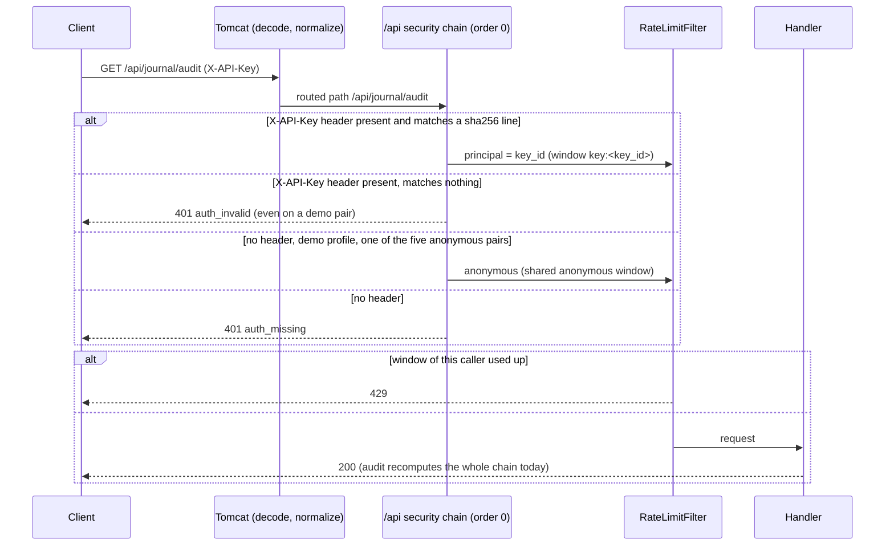
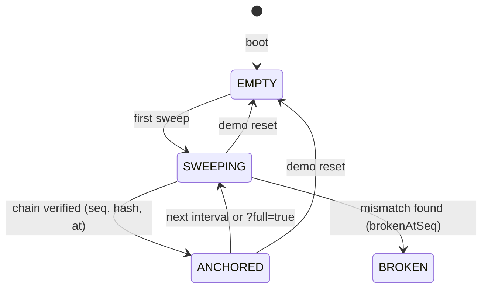

# ADR-0004: API-key auth on `/api`, per-caller rate limit, exact overflow handling, bounded audit (accepted in part; D4 proposed)

## Status
Accepted in part — 2026-09-27. D1, D2, D5 are built. D3 is built as per-caller buckets on the routed path; the
handler-keyed half is not built. D4 (bounded request-time audit) is **proposed and not built**: today every audit
recomputes the whole chain and replays every posting. The handler-keyed half of D3 and all of D4 are descoped for now
(2026-09-28): the decoded-path limiter already counts percent-encoded paths, and the O(n) REST audit is rate limited
per caller.

## Context
The REST surface under `/api` was open in the `default` profile, the audit endpoint reads the whole journal on every
call, and the only brake was one global rate-limit counter that any single caller could use up for everyone.
Out-of-band journal rows can also sum above the 64-bit range, which once surfaced as an exception (HTTP 409) instead
of a tamper verdict.

## Decisions

### D1 — `/api` requires an API key in every profile
A dedicated security chain (`ApiSecurityConfig`, `@Order(0)`, `securityMatcher("/api/**")`, stateless) requires an
`X-API-Key` header; without it the answer is `401` (`auth_missing`, or `auth_invalid` for a key that matches nothing).
Keys never live in the repository: `ApiKeyStore` reads `<key_id> sha256:<hex>` lines from the file named by
`LEDGERMIND_API_KEYS_FILE` and refuses to start when the variable is unset, the file is missing or a line is
malformed (an existing empty file is valid and means no keyed callers). The authenticated principal is the key_id,
never the key.
Rejected: **OAuth on `/api`** — `/mcp` already uses OAuth with audience validation; putting a token flow in front of
a REST demo adds an authorization server round-trip for every script and gains nothing a hashed static key does not
give at this scale.

### D2 — anonymous access only under `demo`, to exactly five pairs
Only under the `demo` profile, five method+path pairs are anonymous, listed literally (no `/api/demo/**` wildcard):
`POST /api/demo/reset`, `POST /api/demo/idempotency`, `POST /api/demo/tamper`, `POST /api/demo/reconcile`,
`GET /api/demo/audit`. Every other `/api` request needs a key in every profile.

### D3 — rate limit counted per caller
`RateLimitFilter` (a servlet filter that runs after the security chain, so a `401` is never counted) keeps one fixed
window per caller, by default 30 requests per 10 s (`ledgermind.rate-limit.max-per-window`,
`ledgermind.rate-limit.window-ms`): `key:<key_id>` for a keyed request, and one `anonymous` window shared by
all anonymous demo callers. A window resets on the first request that arrives more than `window-ms` after it
opened, so up to twice the limit fits in a `window-ms` span that straddles a boundary (`RateLimitFilterClockTest`).
It covers `/api/demo/**` and `/api/journal/**` (nested paths such as `/api/journal/checkpoint/verify` too), matched on the decoded, normalized path
the container routes (`RateLimitEncodedPathTest`). One key using up its window does not limit another key, and the
anonymous demo cannot limit keyed callers (`RateLimitPerCallerTest`). The number of windows is bounded by the keys
file plus one.
Not built: keying on the handler Spring resolves (a `HandlerInterceptor`) instead of the routed path.
Rejected: **per-IP buckets** — behind a proxy or a PaaS router every caller shares an address, and IPs are cheap
to rotate; the key_id is the identity the server already authenticated.

### D4 — bounded request-time audit (PROPOSED, NOT BUILT)
Proposal: a request-time audit recomputes at most the last `recent-window` links plus the links added since the last
full sweep; a streamed background sweep recomputes the whole chain every `sweep-delay-ms` and records an anchor; an
edit to an older posting is detected within one sweep interval plus the sweep's duration, or immediately with
`?full=true`. Today `verify()` still recomputes every chained posting on every call, so the audit's cost grows with
the journal and on `/api` it is only protected by D1 and D3. The MCP audit (`verify_journal_integrity` on `/mcp`) is
protected by neither: it needs an OAuth token, not an API key, and the rate limit does not match `/mcp`; under the
`demo` profile the token comes from the demo client credential the README publishes, so anyone can run full audits
there with no limit.
Rejected alternatives recorded for when it is built: **sweep state in a DB row** — an attacker who can edit the
journal out of band can edit that row too, so the anchor is kept in process memory and rebuilt by a sweep at boot;
**synchronous full recompute on every request** — the current behaviour, whose cost is O(n) per call.

### D5 — exact sums, overflow is a verdict or a 422, never an exception
The balance replay reads the journal sums as exact integers (`AccountBalanceVerifier`, `BigInteger`), so a journal sum
above the 64-bit range is reported as a balance mismatch and `tamperDetected=true`, never as an error
(`AccountBalanceSumOverflowTest`, `AccountBalanceSumOverflowPropertyTest`, `OverflowAuditHttpTest`). A transfer that
would overflow a counter is rejected with `422` (`Account.addExact`, `AccountCounterOverflowTest`). Reconciliation
sums are exact and only a final value outside the range is rejected (`ReconciliationMatcherOverflowTest`,
`ReconciliationMatcherOverflowAdversarialTest`).

## Diagrams

Request path as built (D1-D3):

Proposed D4 sweep state (not built):

## Consequences
- (+) No anonymous write or audit on `/api` outside the five demo pairs, in any profile; keys are never in the
  repository.
- (−) The MCP audit is outside D1 and D3: under the `demo` profile anyone holding the README's public demo client
  credential can call `verify_journal_integrity` (a full O(n) audit) with no rate limit.
- (+) One noisy caller cannot put another key's audits in `429`.
- (−) Every deploy must provide `LEDGERMIND_API_KEYS_FILE` (an empty file for an anonymous-only demo), or the app
  does not start.
- (−) Anonymous demo callers share one window and can still limit each other.
- (−) Until D4 is built, each audit call costs O(n) in the journal.
